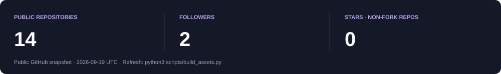

<!-- Upload README.md, assets/, scripts/ and .github/workflows/ to the repository root. -->

  

<table>
<tr>
<td width="25%" align="center" valign="middle">
  
</td>
<td width="75%" valign="middle">
  <h2>Hi, I'm Mahid.</h2>
  
<strong>CSE undergraduate exploring how intelligent systems work.</strong>

  
I study at <strong>East West University</strong> and learn by building: machine-learning notebooks, computer-vision experiments and interactive data dashboards.

  
I like turning a concept into code, testing its limits, and explaining what I learn along the way.

  

    
    
  

</td>
</tr>
</table>

  <a href="#focus">Focus</a> &nbsp; · &nbsp;
  <a href="#projects">Projects</a> &nbsp; · &nbsp;
  <a href="#toolkit">Toolkit</a> &nbsp; · &nbsp;
  <a href="#contribution-snake">Snake</a> &nbsp; · &nbsp;
  <a href="#github-snapshot">GitHub</a> &nbsp; · &nbsp;
  <a href="#connect">Connect</a>

## Focus

<table>
<tr>
<td width="50%" valign="top">
<h3>01 / Machine &amp; Deep Learning</h3>

Supervised and unsupervised learning, ensembles, optimisation, neural networks and model evaluation.

</td>
<td width="50%" valign="top">
<h3>02 / Computer Vision</h3>

Image filtering, transforms, feature extraction and CNN-based visual representations.

</td>
</tr>
<tr>
<td width="50%" valign="top">
<h3>03 / Data Science</h3>

Data cleaning, exploratory analysis, feature engineering, visualisation and interactive dashboards.

</td>
<td width="50%" valign="top">
<h3>04 / Algorithms</h3>

Data structures, complexity analysis and competitive programming on Codeforces and LeetCode.

</td>
</tr>
</table>

## Projects

A selection of my learning journeys, coursework and practical experiments.

<table>
<tr>
<td width="50%" valign="top">

DEEP LEARNING · LEARNING IN PUBLIC

<h3><a href="https://github.com/mahidrahman375/100-days-of-deep-learning">100 Days of Deep Learning ↗</a></h3>

Daily notebooks exploring neural-network architectures, training loops and experiments.

<code>Python</code> <code>Jupyter</code> <code>Colab</code>

</td>
<td width="50%" valign="top">

MACHINE LEARNING · LEARNING IN PUBLIC

<h3><a href="https://github.com/mahidrahman375/100-days-of-machine-learning">100 Days of Machine Learning ↗</a></h3>

Machine-learning theory and practical implementations, explored one concept at a time.

<code>Python</code> <code>scikit-learn</code> <code>Jupyter</code>

</td>
</tr>
<tr>
<td width="50%" valign="top">

DATA ANALYSIS · INTERACTIVE APP

<h3><a href="https://github.com/mahidrahman375/workload-and-mental-health-analysis-dashboard-using-stramlit">Workload &amp; Mental Health ↗</a></h3>

An interactive dashboard for exploring workload and mental-health-related data through analysis and visualisation.

<code>Python</code> <code>Streamlit</code> <code>pandas</code>

</td>
<td width="50%" valign="top">

DATA ANALYSIS · EXPLORATION

<h3><a href="https://github.com/mahidrahman375/loan_data_analysis">Loan Data Analysis ↗</a></h3>

Exploratory analysis of loan data, using distributions and visualisations to understand patterns.

<code>Python</code> <code>pandas</code> <code>Jupyter</code>

</td>
</tr>
<tr>
<td width="50%" valign="top">

COMPUTER VISION · CSE438

<h3><a href="https://github.com/mahidrahman375/CSE438-Digital-Image-Processing">Digital Image Processing ↗</a></h3>

Image-processing implementations, experiments, reports and visualisations from my university coursework.

<code>Python</code> <code>OpenCV</code> <code>Jupyter</code>

</td>
<td width="50%" valign="top">

MACHINE LEARNING · CSE475

<h3><a href="https://github.com/mahidrahman375/CSE475-Machine-Learning">Machine Learning Coursework ↗</a></h3>

Lab work covering supervised and unsupervised learning, ensembles, optimisation and neural networks.

<code>Python</code> <code>scikit-learn</code> <code>Jupyter</code>

</td>
</tr>
</table>

<a href="https://github.com/mahidrahman375?tab=repositories"><strong>Explore all repositories →</strong></a>

## Toolkit

<strong>University coursework</strong>

<ul>
<li><strong>CSE475:</strong> Machine Learning</li>
<li><strong>CSE438:</strong> Digital Image Processing</li>
<li><strong>CSE412:</strong> Software Engineering</li>
</ul>

## Contribution snake

<picture>
  <source media="(prefers-color-scheme: dark)" srcset="./assets/snake-dark.svg" />
  <source media="(prefers-color-scheme: light)" srcset="./assets/snake-light.svg" />
  
</picture>

## GitHub snapshot

[Repositories and recent updates](https://github.com/mahidrahman375?tab=repositories) · [Contribution activity](https://github.com/mahidrahman375?tab=overview)

## Problem solving

I practise algorithms and data structures to strengthen the reasoning behind the code.

**Think → Implement → Test → Understand**

## Connect

Let's talk about **AI, machine learning, computer vision, data science or software development**.

[Message me on LinkedIn](https://linkedin.com/in/yeamin-rahman-mahid-957a551a9) · [Explore my GitHub](https://github.com/mahidrahman375)

For a question about a project, open an issue in that repository.

---

